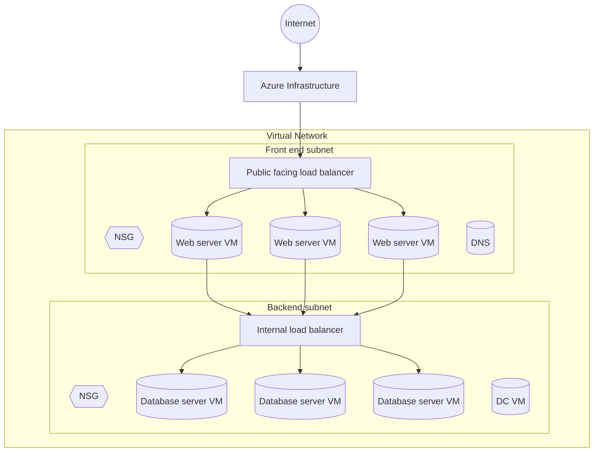

# Azure Global Network

- One of the largest networks in the world
- 165,000 miles of lit fibre-optic and undersea cable
- 61+ regions (more added all the time)
- 100+ data centers
- 185 points-of-presence (POPs)
- Not the public Internet; this is a private network

Reference: https://azure.microsoft.com/explore/global-infrastructure/

Reference (map landing page): https://infrastructuremap.microsoft.com/

Reference (interactive map): https://datacenters.microsoft.com/globe/explore

## Azure Virtual Network (VNet)

- The cloud representation of a physical network (virtual)
- Subdivided into “subnets”
- All VNets must have at least one subnet
- Handles DHCP services
	- DHCP = Dynamic Host Configuration Protocol
	- Automatically provides IP configuration (IP address, subnet mask, default gateway, DNS)
	- In Azure, DHCP is provided by the VNet/subnet so VMs get network settings automatically (you can also specify custom DNS servers)
- Can be secured using an access control list (NSG)

## VMs on VNets

- All virtual machines must be part of a network
- Like physical hardware, VMs can have multiple NIC cards (so VMs can belong to multiple networks)
- All virtual networks have an “address block” of internal IP addresses
- All subnets have an “address block” which is a subdivision of the larger one
- Azure uses CIDR notation for IP addresses
	- CIDR = Classless Inter-Domain Routing
	- Format: IP address + prefix length (e.g., 10.0.0.0/16)
	- The /n is how many bits are the network portion (larger /n = smaller range)
	- Example: 10.0.0.0/24 contains 256 addresses (10.0.0.0–10.0.0.255)
	- In Azure, VNet and subnet address spaces are defined with CIDR blocks

## Example VNet layout (diagram)

